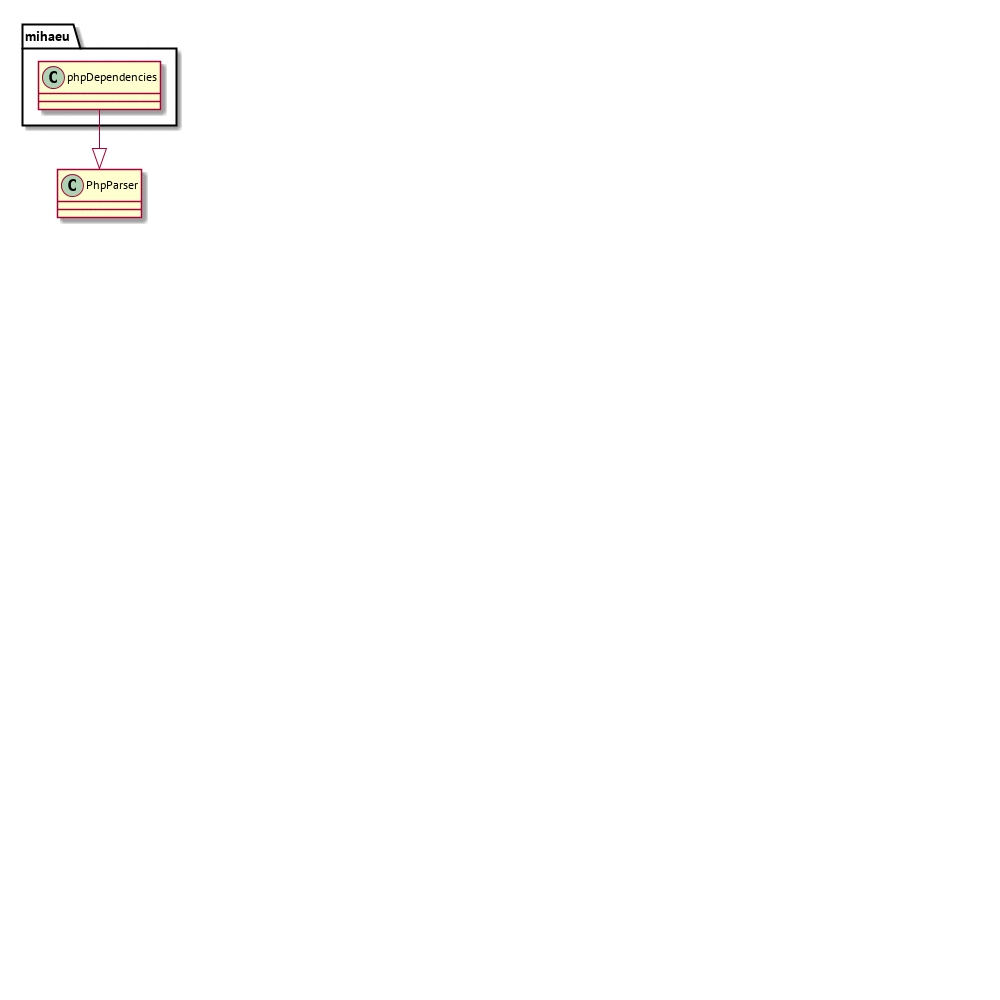

<h1 align="center"><a href="https://dephpend.com/"></a></h1>

[](https://travis-ci.org/github/aaronjewell/dephpend)
[](https://coveralls.io/github/aaronjewell/dephpend)
[](https://packagist.org/packages/dephpend/dephpend)
[](https://github.com/mihaeu/dephpend/blob/main/LICENSE)
[](https://www.php.net/supported-versions.php)

Detect flaws in your architecture before they drag you down into the depths of dependency hell ...

- [What it does](#what-it-does)
- [System Requirements](#system-requirements)
- [Installation](#installation)
  + [Phive](#phive)
  + [Composer](#composer)
  + [Manual .phar download](#manual-phar-download)
  + [Git](#git)
- [Usage](#usage)
  + [Filters](#filters)
  + [Text](#text)
  + [UML](#uml)
  + [Dependency Structure Matrix](#dependency-structure-matrix)
  + [Metrics](#metrics)
  + [Dynamic Analysis](#dynamic-analysis)
    * [Setup](#setup)
    * [Usage](#usage-1)
- [Examples](#examples)
  + [Architecture Constraints](#architecture-constraints)
  + [Architecture Timeline](#architecture-timeline)
- [How it all works](#how-it-all-works)
- [Supported Features](#supported-features)
- [Troubleshooting](#troubleshooting)
  + [Not enough RAM](#not-enough-ram)
- [License](#license)

## What it does

dePHPend helps with bringing your PHP projects back in shape. Over the course
of a project, we usually keep adding more and more dependencies. Often hidden 
behind singletons or service locators, these dependencies can quickly become 
a maintenance (and testing!) nightmare.

dePHPend analyses your app and attempts to find everything you depend on.

With this information you can:

 - get a quick overview of how an application is structured
 - start refactoring where it's needed the most
 - track architecture violations 
    (maybe your view shouldn't be telling the model what to do?)
 - find out why your changes are breaking tests


## System Requirements
- PHP >= 7.2
- plantuml (UML Class diagram)


## Installation

### Docker

If you don't want to worry about PHP versions, composer dependencies etc. you can run dePHPend from a docker container:

```bash
# replace $PATH_TO_INSPECT with whatever path you would live to inspect
docker run --rm -v $PATH_TO_INSPECT:/inspect aaronjewell/dephpend:latest text /inspect
```

### Phive

[Phive](https://phar.io) is the preferred method of installing QA tools which are not linked directly to your code. If you've never heard about it, I'd recommend you check it out. Once installed simply use:

```bash
phive install dephpend

# or

phive install --copy dephpend
```

### Composer

You can install dePHPend globally, but this might lead to problems if other globally installed QA tools use different versions of PhpParser for instance.

```bash
composer global require dephpend/dephpend:dev-main
```

### Manual .phar download

Download the PHAR file by selecting the latest file from [GitHub Releases](https://github.com/mihaeu/dephpend/releases/latest).

### Git

```bash
git clone git@github.com:mihaeu/dephpend.git
# or
git clone https://github.com/mihaeu/dephpend.git

cd dephpend
composer install
```

## Usage

You should almost always run QA tools without XDebug (unless you need code coverage of course). You could use a separate `php.ini` where XDebug is not loaded and pass that to php or you just use the `-n` option (this will however not load any extensions, so you have to specify those separately). 

```
# or bin/dephpend depending on how you installed this
$ php -n -d extension=tokenizer.so -d extension=json.so -d extension=mbstring.so dephpend.phar                                                                                                 
      _      _____  _    _ _____               _ 
     | |    |  __ \| |  | |  __ \             | |
   __| | ___| |__) | |__| | |__) |__ _ __   __| |
  / _` |/ _ \  ___/|  __  |  ___/ _ \ '_ \ / _` |
 | (_| |  __/ |    | |  | | |  |  __/ | | | (_| |
  \__,_|\___|_|    |_|  |_|_|   \___|_| |_|\__,_| version 0.8.1

Usage:
  command [options] [arguments]

Options:
  -h, --help            Display this help message
  -q, --quiet           Do not output any message
  -V, --version         Display this application version
      --ansi            Force ANSI output
      --no-ansi         Disable ANSI output
  -n, --no-interaction  Do not ask any interactive question
  -v|vv|vvv, --verbose  Increase the verbosity of messages: 1 for normal output, 2 for more verbose output and 3 for debug

Available commands:
  dsm            Generate a Dependency Structure Matrix of your dependencies
  help           Displays help for a command
  list           Lists commands
  metrics        Generate dependency metrics
  test-features  Test support for dependency detection
  text           Prints a list of all dependencies
  uml            Generate a UML Class diagram of your dependencies
```

### Filters

Without filters the output for large apps is too bloated which is why I implemented a couple of filters to help you get the output you want:

```bash
      --no-classes                         Remove all classes and analyse only namespaces.
  -f, --filter-from=FILTER-FROM            Analyse only dependencies which originate from this namespace.
      --filter-namespace=FILTER-NAMESPACE  Analyse only classes where both to and from are in this namespace.
  -d, --depth[=DEPTH]                      Output dependencies as packages instead of single classes. [default: 0]
  -e, --exclude-regex=EXCLUDE-REGEX        Exclude all dependencies which match the (PREG) regular expression.

      --dynamic=DYNAMIC                    Adds dependency information from dynamically analysed function traces, for more information check out https://dephpend.com
  -u, --underscore-namespaces              Parse underscores in Class names as namespaces.
      --internals                          Check for dependencies from internal PHP Classes like SplFileInfo.
```

For more info just run `php dephpend.phar help text`.

### Text

For quick debugging use the `text` command. Say you want to find out which classes depend on XYZ and what XYZ depends on, you'd run: 

```bash
php dephpend.phar text src | grep XYZ

# or for more complex applications use filters
php dephpend.phar text symfony --no-classes --depth 3 --exclude-regex='/Test/'
```

### UML

Generates UML class or package diagrams of your source code. Requires [PlantUML](http://plantuml.com/) to be installed.

You can either run 

```bash
php dephpend.phar uml --output=uml.png src

# or for post-processing
php dephpend.phar uml --output=uml.png --keep-uml src
``` 

but most likely what you want to do is to use the `--no-classes` and `--depth[=DEPTH]` option. If your app has more than 20 classes, the UML will become messy if you don't use namespace instead of class level. Experiment with different depth values, but usually a depth of 2 or 3 is what you want.

### Dependency Structure Matrix

If you've tried decrypting massive UML diagrams before, you know that they become very hard to interpret for large applications. DSMs allow you to get a quick overview of your application and where dependency hotspots are.

This feature is still under construction and right now it's not really fun to use. If you still want to try run 

```bash
php dephpend.phar dsm src > dependencies.html

php dephpend.phar dsm src --no-classes | bcat
``` 
or pipe it to something like [bcat](https://rtomayko.github.io/bcat/).

### Metrics

The most common package metrics have already been implemented, but there are more to come. Check them out by running the following command:

```bash
php dephpend.phar metrics src
```

This feature is not production ready and it's better to rely on [PHP Depend](https://pdepend.org) for this.

### Dynamic Analysis

If you want to analyse an old legacy application which makes little use of type hints and other static information and is therefore hard to analyse consider using dynamic analysis.

dePHPend can analyse XDebug trace files and add that information to the static result.

#### Setup

Make sure you have XDebug installed and included in your `php.ini`. Also make sure to include the following in the XDebug section of your `php.ini`:

```ini
; you should already have this somewhere in your php.ini
zend_extension=path-to-your-xdebug/xdebug.so

[xdebug]
...

; add this for tracing function calls
xdebug.auto_trace=1
xdebug.collect_params=1
xdebug.collect_return=3
xdebug.collect_assignments=1
xdebug.trace_format=1

```

This will slow down PHP A LOT so it is best to put it in a separate file like `php-with-traces.ini` and call dePHPend using `php -c /path/to/php-with-traces.ini`.

#### Usage

First create the sample data by running any PHP script (or website) with the above settings in your `php.ini` (set `xdebug.trace_options=1` if you want to track multiple calls, but this will make the trace file grow BIG).

```bash
# use your tests (but make sure to exclude unwanted data using filters)
php -c php-with-traces.ini vendor/bin/phpunit

# or using PHP's inbuilt server etc.
php -c php-with-traces.ini -S localhost:8080
```

The better the sample run and the more of your application it covers, the better the results are going to be. After that process the trace file using the `--dynamic` option.

```bash
php dephpend.phar text src                  \
    --no-classes                            \
    --filter-from=Mihaeu\\PhpDependencies   \
    --exclude-regex='/(Test)|(Mock)/'       \
    --dynamic=/tmp/traces.12345.xt          
```

You will probably always end up using filters like `--filter-from` because the dynamic parser parses everything not just the stuff from the directory provided. So all third party stuff is going to show up as well.

The trace file, by default, will be in your system's temporary folder. This can be changed by setting `xdebug.trace_output_dir` and `xdebug.trace_output_name` in your `php.ini` ([see XDebug Function Traces](https://xdebug.org/docs/execution_trace)).

## Examples

### Architecture Constraints

Using the `text` command it is fairly straightforward to create a script which validates your architecture:

```php
#!/usr/bin/env php
<?php

$output = shell_exec('php dephpend.phar text src --no-classes');
$constraints = [
    'OS --> .*Analyser',
    'Analyser --> .*OS',
];
if (preg_match('/('.implode(')|(', $constraints).')/', $output)) {
    echo 'Architecture violation'.PHP_EOL;
    exit(1);
}
```

Save this in your `.git/hooks/pre-commit` or `.git/hooks/pre-push` and you'll never violate your project managers trust again. You could also include this on every Travis or Jenkins CI build, but I prefer to not bother the CI when I can check it myself.

### Architecture Timeline

Executing dePHPend's metric command on any branch `git log --pretty=%H` and using `convert -delay 100 -loop 0 *.png dephpend-timeline.gif` you can create a nice animation detailing the evolution of your architecture:



## How it all works

Basically the process can be broken down into four steps (the actual work is a bit more complicated and for those interested, I'll publish a paper about it, later this year):

 - find all relevant PHP files
 - generate an abstract syntax tree using [php-parser](https://github.com/nikic/PHP-Parser) by the awesome Nikita Popov
 - traverse the tree, gathering dependencies along the way
 - pass the information to a formatter

## Supported Features

Check out `tests/features` for examples of supported features or run `bin/dephpend test-features` for a list of supported detection features:

```bash
[✓]  creating objects
[✓]  using traits
[✓]  extending other classes
[✓]  type hints in method arguments
[✓]  param return throws in doc comment
[✓]  implementing interfaces
[✓]  php7 return value declaration
[✓]  call to static method
[✗]  return value of known method
[✗]  method arguments and return value from doc
[✗]  known variable passed into method without type hints
[✗]  creating objects from strings
```

## Troubleshooting

### Not enough RAM

The PHP-Parser can take up lots of RAM for big applications. You can adjust the RAM limit in your `php.ini`, but a safer solution would be to call dePHPend by adding `php -n -d memory_limit=1024M dephpend.phar ...`.

## License

See [LICENSE](LICENSE) file
